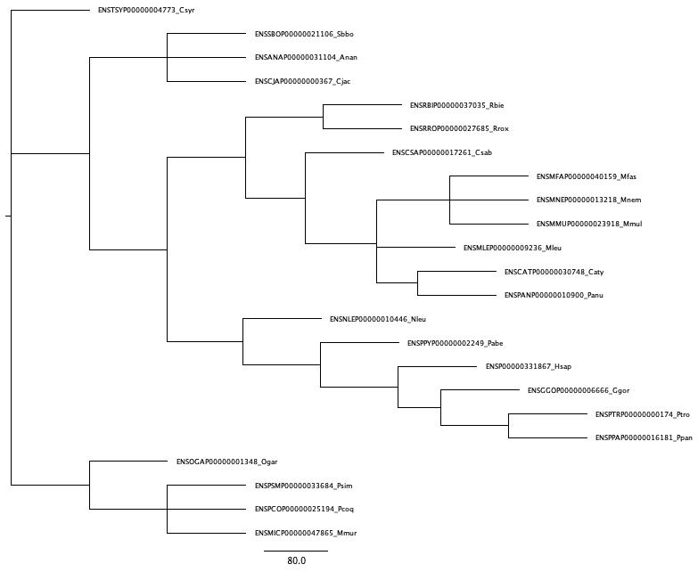
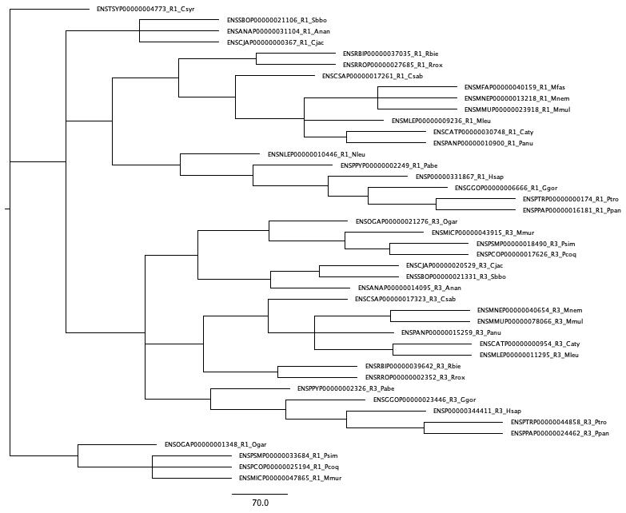

# INTRODUCTION/BACKGROUND/HYPOTHESES 
 
During hominin evolution, it is thought that the introduction of meat into 
the hominin diet provided a new, calorically rich food source that 
resulted in a higher daily caloric intake. This increased caloric 
availability may have facilitated hominin brain evolution, as human brains 
have intense energetic demands (~20-25% of resting metabolic rate) 
compared to the average primate (~9%) and the average mammal (~3-5%) 
(Leonard, 2007). The incorporation of meat in the hominin diet preceded 
hominin brain expansion (Ferraro, 2013) and, furthermore, other primates such 
as chimpanzees, bonobos, baboons and capuchins also participate in meat eating 
behaviors, although not with regularity (Watts, 2020). **To further evaluate the role of meat in hominin evolution, this first part of this project considers the taste receptors responsible for the transduction of the savory “umami” flavor which is associated with human’s perception of meat.** Two genes, TAS1R1 and TAS1R3, encode the taste receptors responsible for umami flavor in humans (NOTE: more information concerning the specificity of association between umami and meat will be added for next homework). If a dietary transition towards meat eating was a critical shift in hominin evolution, this may have resulted in positive selection on the TAS1R1 and TAS1R3 genes in the hominin lineage. It is important to note, however, that the sole analysis of these umami receptor genes is not sufficient to provide strong support or rejection of the importance of meat in the hominin diet. Rather, the exploration of TAS1R1 and TAS1R3 in this analysis is a "first run" of a larger analysis to be completed in the upcoming summer where a collection of genes related to protein digestion will undergo similar analyses. While its likely the inclusion of additional genes will provide a more complete exploration of human's relationship with meat, these future steps are critical as the TAS1R1 and TAS1R3 genes appear to serve several dietary purposes in other primate lineages beyond simple transduction of umami flavor. For example, Todo et al. cloned TAS1R1 receptors of numerous primates across the primate phylogeny and exposed these receptors to L-glutamate (L-glu) and 5'ribonucleotides. They found folivorous primate receptors were responsive to L-glu, which is a prominent component of leaves, and insectivorous primate receptors were responsive to 5' ribonucleotides, which is a prominent component of insects. Interestingly, the receptors of dietary generalists were responsive to both L-glu and 5' ribonucleotides. These researchers identified two amino acid residue mutations which enabled these responsivity differences between folivorous primates and insectivorous primates (Toda, 2021). The strong association of folgivorous diet/L-glu receptor response and insectivorous diet/5' ribonucletide receptor response suggests a shared importance of these receptors across primates as well as emphasizes the receptor's multi-functionality dependent on diet. **Thus, the second part of this project is to examine possible selection on these receptors throughout primates.**

**HYPOTHESES**

Given the suggested importance of meat in the hominin lineage, it logically follows that, if true, the receptors critical for the transduction of meat flavor would experience selection in the hominin lineage: 

**H1: TAS1R1 and/or TAS1R3 will show signatures of positive selection in the human lineage, as determined by comparison of the human foreground branch model results and the null model results via a likelihood ratio test.**

As several other primates also partake in meat eating behaviors, these primates may also show positive selection on either receptor gene:

**H2: Primates known to participate in meat eating behaviors, such as the chimpanzee, will show selection on TAS1R1 and/or TAS1R3, as determined by comparison of the foreground branch model results and the null model results via a likelihood ratio test.**

In the broader primatological context, these receptors appear to serve several dietary functions. For example, the TAS1R1 receptor of dietary specialists, such as fully folivorous or insectivorous primates, demonstrate highly specific and exclusive responses to the molecules that comprise their specialized diets. This, perhaps, suggests heightened importance of these receptors to dietary specialists: 

**H3: TAS1R1 and/or TAS1R3 will show signatures of positive selection in predominately insectivorous primates such as the tarsier, as determined by comparison of the tarsier foreground branch model results and the null model results via a likelihood ratio test.**

**H4: TAS1R1 and/or TAS1R3 will show signatures of positive selection in predominately folivorous primates such as the gorilla, as determined by comparison of the tarsier foreground branch model results and the null model results via a likelihood ratio test.** 

As specific amino acid residues were identified as important in facilitating a strong response to either L-glu or 5'ribonucleotides in Toda et al., I anticipate that the evaluation of these sites will show selection:  

**H5: Both predominately insectivorous primates and predominately 
folivorous primates will demonstrate selection at the sites 170 and 302 of 
the TAS1R1 gene, as determined by Bayes Empirical Bayes method.** 

While all above hypotheses have suggested positive selection, its possible that primates with very general diets or perhaps predominately frugivorous diets may not show selection:

**H6: TAS1R1 and/or TAS1R3 will not show signatures of selection in dietary generalists who do not exhibit meat eating behaviors, as determined by comparison of the foreground branch model results and the null model results via a likelihood ratio test.**

# TAS1R1 AND TAS1R3 GENE HISTORY
Both TAS1R1 and TAS1R3 were examined on ensembl.org. For both genes, all 
primate species had 1:1 orthologue status, meaning only one copy was found 
in each of species. To further examine the possibility of gene duplication 
events or any other complexity of gene history confounding analyses of 
these genes, I separately ran both the TAS1R1 and TAS1R3 human amino acid 
transcripts through BlastP to check the sequences that returned with high 
similarity. For both genes, all returning sequences were labeled as the 
gene of interest. There did not appear to be any other sequences 
returning. However, some species did have multiple isoforms of the gene. I 
individually checked each primate from Ensembl.org and some species did 
have 2-4 known splice variants for either gene, so these results were not 
surprising.

# COMPLETED METHODS
DNA and amino acid sequence data for the TAS1R1 gene (ENSG00000173662) and 
the TAS1R3 gene (ENSG00000169962) were gathered from ensembl.org on 
February 8th, 2023. Ensembl identified 22 species of primates with 
orthologous sequences for TAS1R1 and 19 species of primates with 
orthologous sequences for TAS1R3. Both the amino acid sequence and the DNA 
sequence were downloaded and aligned using muscle. Following this 
alignment, all gaps in the DNA were checked and manually adjusted based on 
the amino acid alignment to ensure proper reading frame of codons. The 
TAS1R1 alignment was noted to be of high quality with only Neumascus 
leugenys (Gibbon) needing adjustment. The TAS1R3 alignment showed more 
mutations between species. Particularly, Roxellana bieti (black snub nose 
monkey) showed numerous insertions and deletions throughout the alignment. 
Although the subsequent steps were performed with the black snub nose 
monkey in the TAS1R3 alignment, future re-analyses may remove this species 
to see if it impacts the results, as this primate appears to be an extreme 
outlier. Aside from the black snub nose monkey, the TAS1R3 alignment was 
also of good quality. Following DNA alignment, the alignments for TAS1R1 
and TAS1R3 were input in PAUP and both underwent a Maximum 
Likelihood bootstrap analysis (500 replicates). The resultant trees showed 
that all primates grouped together based on relatedness for both genes 
(i.e. New World Monkeys formed a clade, Old World Monkeys formed a clade, 
etc). The majority of bootstrap values were greater than 95 with the 
exception of four values for TAS1R1 (52.2, 54, 76.8, and 86.6) and four 
values for TAS1R3 (58.6, 60.4, 63.8 and 81.6). Additionally, the 
TAS1R1 and TAS1R3 alignment files were combined then input together 
into PAUP, where they underwent a Maximum Likelihood bootstrap (500 
replicates) as described above. The prosimian TAS1R1 gene was the 
outgroup. Following this, the TAS1R1 and TAS1R3 genes split and, following 
this split, both genes grouped via relatedness. These trees can be viewed 
below. More detailed explanations of these steps were documented in 
README.md files and can be provided upon request.

# FUTURE METHODS
The tree and alignments will be analyzed in PAML to evaluate possibility 
of selection. I have spent the last two weeks using example data sets to test proper usage of PAML (general protocols evaluated from Bielawski 2013, Bielawski 2016, and Yang 1997). Additionally, I have begun to draft an R script, which I am currently in the process of editing. I anticipate doing test runs of this script this coming week and troubleshoot arising issues. The goal will be to have a refined script the following week and to use Argon to run my analyses. When I run my analyses, I anticipate using both PAML's branch model and branch site model. PAML's branch model will be used to evaluate possible selection on primate lineages. Each primate species will be treated as the foreground branch in independent runs. Additionally, human and all non-human primate lineages will undergo branch-site model tests. I anticipate results in line with previous hypotheses. 
 

# ANTICIPATED IMAGE 
Following these PAML analyses, I will use R to construct a primate phylogeny which will document type of selection (negative, neutral or positive) on each primate branch (see Image 2 for the image of inspiration). I anticipate importing a phylogenetic tree into R, then I will use packages such as ggtree in R to modify the tree. As in my inspiration image, I anticipate using color coordinated node labels to indicate negative, neutral or positive selection on that branch. This can be done in R. As far as the vertical group labels, I will attempt to find functions in R to acheive this look, although at this moment I am unaware of such functions or aesthetics. However, if I am unable to produce this in R, I will export the image with its colored nodes then make the subsequent additions (the side label groupings) in powerpoint.

# REFERENCES
Bielawski, Joseph P. "Detecting the signatures of adaptive evolution in 
protein-coding genes." Current protocols in molecular biology. January 15, 
2013, 101. DOI: https://doi.org/10.1002/0471142727.mb1901s101.

Bielawski, Joseph P., Jennifer L. Baker, and Joseph Mingrone. “Inference 
of episodic changes in natural selection acting on protein coding 
sequences via CODEML.” Current protocols in bioinformatics. June 20, 2016, 
54. DOI: https://doi.org/10.1002/cpbi.2.

Ferraro, Joseph V., Thomas W. Plummer, Briana L. Pobiner, James S. Oliver, 
Laura C. Bishop, David R. Braun, Peter W. Ditchfield et al. “Earliest 
archaeological evidence of persistent hominin carnivory.” PloS one 8, 
April 25, 2013, 4. DOI:10.1371/journal.pone.0062174.

Leonard, William. R., Josh J. Snodgrass, and Marcia L. Robertson. “Effects 
of brain evolution on human nutrition and metabolism.” Annu. Rev. Nutr, 
August 21, 2007, 27. DOI: 10.1146/an- nurev.nutr.27.061406.093659.

Toda, Yasuka, et al. "Evolution of the primate gluatamate taste sensor 
froma  nucleotide sensor." Current Biology. October 25, 2021, 31. 
DOI:https://doi.org/10.1016/j.cub.2021.08.002. 

Watts, David P. "Eating eating by nonhuman primates: A review and 
synthesis." Journal of Human Evolution. October 24, 2020, 149. DOI: 
Https://doi.org/10.1016/j.jhevol.2020.102882. 

Wu, Yonghua, Haifeng Wang, Haitao Wang, and Elisabeth A. Hadly. 
"Rethinking the origin of primates by reconstructing their diel activity 
patterns using genetics and morphology." Scientific Reports, September 19 
2017, 7(1). DOI: https://doi.org/10.1038/s41598-017-12090-3. 

Yang, Ziheng. "PAML: a program package for phylogenetic analysis by 
Maximum likelihood." Computer applications in the biosciences, October 1, 
1997, 13(5). DOI: 10.1093/bioinformatics/13.5.555. 

# APPENDIX 

